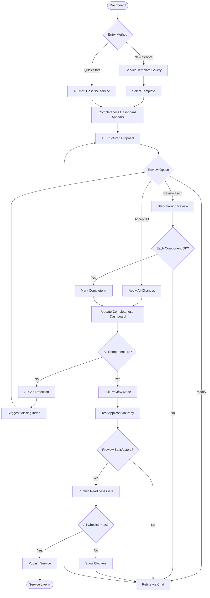
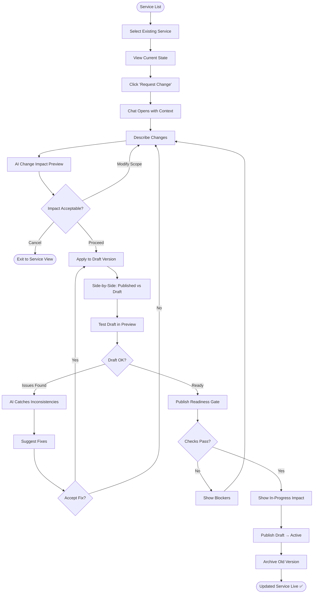
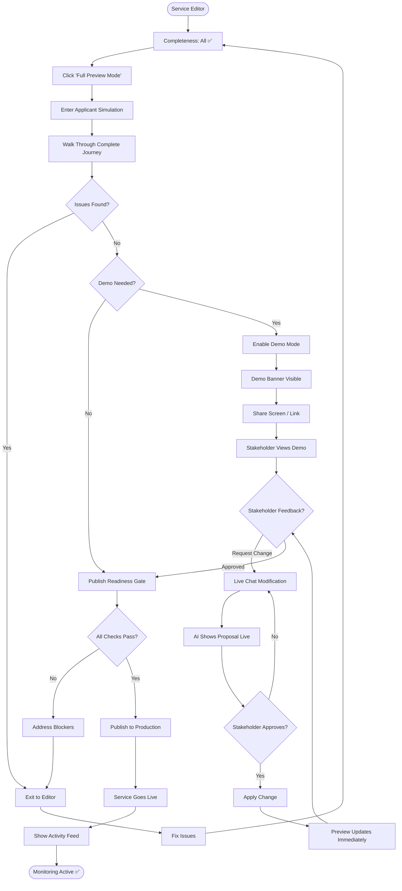

# UX Design Specification bpa-ai-native

**Author:** Moulaymehdi
**Date:** 2025-12-27

---

<!-- UX design content will be appended sequentially through collaborative workflow steps -->

## Executive Summary

### Project Vision

BPA AI-Native reimagines government service configuration as a conversation rather than a construction project. The platform transforms how ministry officials create and manage citizen services—from business permits to professional licenses—by replacing complex drag-and-drop form builders with natural language interaction.

**The Core Promise:** A ministry official describes what they need in plain language, and the AI builds it. No technical training required. No manual field configuration. Just conversation leading to working government services.

### Target Users

**Primary Persona: The Ministry Official**
- Business analysts and administrative officers in government ministries
- Developing country context with varying digital infrastructure
- Domain experts who understand regulatory requirements deeply
- Non-technical background; may have limited experience with modern software
- Often working under time pressure to digitize government services
- May have unreliable internet connectivity

**Key User Needs:**
1. Create forms without learning technical interfaces
2. Understand what they're building at every step
3. Get expert guidance on best practices
4. Make changes easily without starting over
5. Preview exactly what citizens will experience

### Key Design Challenges

1. **Complexity Abstraction**
   - BPA services involve forms, workflows, approvals, integrations, and business rules
   - Users shouldn't need to understand JSON Schema, BPMN, or API contracts
   - The AI must translate natural language into correct technical configurations

2. **Conversation-First Interaction**
   - Replacing button-driven UI with dialogue-driven experience
   - Users must feel in control despite AI doing heavy lifting
   - Balance between guidance and user agency

3. **Visual Workflow Design**
   - Process flows need visual representation users can understand
   - Non-technical vocabulary for states, transitions, and conditions
   - Preview-driven editing with immediate visual feedback

4. **Accessible Terminology**
   - Avoid jargon: "determinants", "form components", "registrations"
   - Use domain language: "approval steps", "required documents", "conditions"
   - Consistent vocabulary throughout the experience

5. **Preview-Driven Confidence**
   - Users need to see exactly what citizens will experience
   - Live preview during conversation-based building
   - Visual validation before publishing

### Design Opportunities

1. **AI as Expert Partner**
   - AI doesn't just execute—it advises, suggests, and validates
   - Proactive recommendations based on service type
   - Template suggestions from similar successful services

2. **Template-Driven Efficiency**
   - Start from proven patterns rather than blank canvas
   - AI suggests templates based on service description
   - Easy customization of starting points

3. **Premium Government Aesthetic**
   - UBS-inspired design: professional, trustworthy, sophisticated
   - Clean layouts with generous whitespace
   - Subtle animations that communicate quality

4. **Progressive Disclosure**
   - Simple defaults with power features available
   - Complexity revealed only when needed
   - Expert mode for advanced users who want direct control

## Core User Experience

### Defining Experience

The core experience of BPA AI-Native is a **conversation that builds government services**. Users describe what they need—in plain language, using their domain vocabulary—and the AI constructs forms, workflows, and business rules in real-time.

This is fundamentally different from traditional form builders where users drag components and configure properties. Here, the user stays focused on *what* they need while the AI handles *how* it's implemented.

**The Core Loop:**
1. User describes a need ("I need a business permit application")
2. AI generates initial structure with intelligent defaults
3. User previews exactly what citizens will see
4. User refines through continued conversation
5. Repeat until satisfied, then publish

### Platform Strategy

**Primary Platform:** Web application with responsive design
- Desktop-first for intensive configuration work
- Tablet-compatible for review and approvals
- Mobile support for monitoring and notifications

**Technical Requirements:**
- Modern browsers (Chrome, Edge, Firefox, Safari)
- Offline draft saving for unreliable connectivity
- Keyboard-optimized with touch support
- Low-bandwidth mode for constrained networks

**Accessibility:**
- WCAG 2.1 AA compliance
- Screen reader compatible
- Keyboard navigation throughout
- High contrast mode available

### Effortless Interactions

**Must Feel Effortless:**

1. **Starting Fresh**
   - Single click to begin
   - AI asks guiding first question
   - Template suggestions appear immediately

2. **Describing Requirements**
   - Natural language input
   - AI understands domain vocabulary
   - No technical terminology required

3. **Making Changes**
   - Conversational modifications ("make phone optional")
   - Changes apply without breaking existing work
   - Easy undo for any action

4. **Previewing Results**
   - Live preview always visible
   - Toggle between citizen and admin views
   - Test with sample data

5. **Publishing Services**
   - Clear validation before publish
   - Confidence-building summary
   - One-click deployment

### Critical Success Moments

**First Impression (0-30 seconds):**
- Dashboard loads instantly with clear next action
- User understands what they can do without training
- First interaction feels responsive and intelligent

**First AI Generation (First Conversation):**
- AI response appears within 2 seconds
- Generated form matches user intent
- Preview shows recognizable structure

**First Modification:**
- User request is understood correctly
- Change applies without side effects
- User feels in control, not fighting the system

**First Publish:**
- Clear confirmation of what will go live
- Validation summary shows no issues
- User feels confident, not anxious

**Return Visit:**
- Previous work is exactly as left
- Easy to pick up where stopped
- AI remembers context

### Experience Principles

1. **Conversation Over Configuration**
   - Natural language as primary interface
   - AI translates intent to technical implementation
   - No complex menus or property panels by default

2. **Preview-Driven Confidence**
   - Always show what citizens will experience
   - Live updates during conversation
   - Test mode with sample data

3. **Intelligent Guidance**
   - AI suggests best practices proactively
   - Templates based on service description
   - Warnings before potential issues

4. **Progressive Complexity**
   - Simple defaults, power features discoverable
   - Expert mode available but never required
   - Complexity revealed only when needed

5. **Trust Through Transparency**
   - Show what AI did and why
   - Easy undo and refinement
   - Never feel like a black box

## Desired Emotional Response

### Primary Emotional Goals

Users of BPA AI-Native should feel:

1. **Empowered** - Capable of creating government services independently, without IT support or technical training
2. **Confident** - Certain about what they're building and that it will work correctly
3. **Supported** - Guided by an expert AI partner who understands their domain
4. **Professional** - Using a sophisticated tool that reflects their role and expertise
5. **In Control** - Making real decisions while AI handles implementation details

**The Core Emotional Promise:**
> "I told it what I needed, and it built exactly that. I felt like I had an expert assistant who truly understood government services."

### Emotional Journey Mapping

**Discovery & Onboarding:**
- **Desired:** Intrigued and reassured
- **Design approach:** Clean, professional landing; quick wins in first minutes; no overwhelming feature tours

**First AI Conversation:**
- **Desired:** Amazed and understood
- **Design approach:** Fast, accurate first response; preview appears immediately; AI uses user's vocabulary

**Active Building:**
- **Desired:** Productive and in control
- **Design approach:** Live preview; easy refinement; visible AI actions; undo always available

**Review & Publishing:**
- **Desired:** Confident and proud
- **Design approach:** Clear validation summary; citizen-view preview; celebratory publish moment

**Error States:**
- **Desired:** Calm and supported
- **Design approach:** Friendly language; specific guidance; auto-save protection; recovery paths

**Return Visits:**
- **Desired:** Familiar and efficient
- **Design approach:** Recent work prominent; context preserved; quick resume

### Micro-Emotions

**Positive Micro-Emotions to Cultivate:**

| Emotion | Trigger Moment | Design Support |
|---------|----------------|----------------|
| Clarity | After AI generates | Show exactly what was created |
| Trust | AI handles complex request | Transparent reasoning |
| Delight | Faster than expected | Smooth animations, quick response |
| Pride | Preview looks professional | Polished citizen-facing design |
| Relief | Change works perfectly | No unintended side effects |

**Negative Micro-Emotions to Prevent:**

| Emotion | Risk Moment | Prevention Strategy |
|---------|-------------|---------------------|
| Confusion | Complex AI output | Plain language explanations |
| Skepticism | First interaction | Immediate accurate result |
| Anxiety | Before publishing | Comprehensive validation |
| Frustration | Request not understood | Clarifying questions, not failures |
| Isolation | Stuck on problem | Proactive help, template suggestions |

### Design Implications

**Empowerment Design:**
- AI suggests options; user makes final decisions
- Easy undo for any action (Ctrl+Z muscle memory)
- No dead ends; always a path forward
- Templates reduce blank-canvas anxiety

**Confidence Design:**
- Split-screen live preview during conversation
- Clear validation before publish
- Test mode with sample data
- Step-by-step confirmation for complex changes

**Support Design:**
- Proactive AI suggestions ("You might also want...")
- Contextual help that anticipates questions
- Template library from successful services
- AI remembers context across sessions

**Professional Design:**
- UBS-inspired premium aesthetic
- Polished micro-interactions
- No amateur or playful elements
- Reflects the serious nature of government work

**Control Design:**
- Show AI actions transparently
- Approve-before-apply for significant changes
- Manual override always available
- Clear separation: user decides, AI implements

### Emotional Design Principles

1. **Never Surprise Negatively**
   - Preview changes before applying
   - Confirm destructive or irreversible actions
   - Auto-save continuously
   - Easy undo for everything

2. **Celebrate Small Wins**
   - Acknowledge completed sections
   - Visual progress indicators
   - Positive feedback on milestones
   - Subtle celebration on successful publish

3. **Fail Gracefully**
   - Friendly, non-technical error messages
   - Suggest specific solutions
   - Never lose user work
   - Clear recovery paths

4. **Build Trust Incrementally**
   - Start with simple, highly accurate responses
   - Show AI reasoning when helpful
   - Be honest about limitations
   - Consistent, predictable behavior

5. **Respect User Expertise**
   - Use domain vocabulary they know
   - Don't over-explain the obvious
   - Offer advanced options for power users
   - Treat them as the expert they are

## UX Pattern Analysis & Inspiration

### Inspiring Products Analysis

**UBS Digital Banking (Primary Inspiration)**

UBS represents the gold standard for premium, professional web applications. Their design demonstrates that complex financial operations can feel simple and trustworthy. Key lessons:

- **Visual Language:** Restrained color palette with strategic use of UBS Red (#E60100), primarily black and white with red accents
- **Typography:** Clean hierarchy using Inter/SF Pro, generous line heights, clear weight distinctions
- **Spacing:** Generous whitespace (8/16/24/32px scale) creating calm, professional feel
- **Components:** Consistent 12px border radius, subtle shadows, polished micro-interactions
- **Data Display:** Tables and charts that are clear without overwhelming

**ChatGPT / Claude (AI Conversation Pattern)**

Modern AI interfaces have established patterns for natural human-AI interaction:

- Threaded conversation with clear message attribution
- Streaming responses showing AI "thinking" in real-time
- Easy editing and regeneration of AI outputs
- Context preservation across sessions
- Elegant display of structured outputs (code, tables)

**Notion (Content Building)**

Notion demonstrates how complex content creation can feel effortless:

- Slash commands for quick action discovery
- Block-based content with intuitive manipulation
- Inline editing without mode switching
- Templates as accelerators, not constraints
- Collaborative features that enhance rather than interrupt

**Linear (Modern SaaS Workflow)**

Linear shows how workflow tools can feel fast and focused:

- Keyboard-first navigation for power users
- Universal search (Cmd+K) across all content
- Status-driven visual workflows
- Minimal UI chrome, maximum content focus
- Smooth, purposeful micro-interactions

### Transferable UX Patterns

**Navigation Patterns:**
- Command palette (Ctrl+K) for universal search and actions
- Breadcrumb navigation for deep hierarchies
- Sidebar for primary navigation, content area maximized
- Status-based filtering and views

**Interaction Patterns:**
- Split-screen: conversation on left, live preview on right
- Streaming AI responses with progressive form generation
- Slash commands for quick actions (/template, /preview, /publish)
- Inline editing without mode switching
- Keyboard shortcuts for power users

**Visual Patterns:**
- Consistent 12px border radius throughout
- 8/16/24/32px spacing scale
- Card-based layouts for scannable content
- Status indicators with limited color palette
- Subtle shadows for depth and focus

**Feedback Patterns:**
- Real-time validation with inline messages
- Progress indicators for multi-step operations
- Toast notifications for non-blocking feedback
- Celebratory moments for key completions

### Anti-Patterns to Avoid

**Navigation Anti-Patterns:**
- Tab overload (legacy BPA has 20+ tabs)
- Nested modals that break context
- Deep nesting requiring many clicks
- Hidden or inconsistent navigation

**Interaction Anti-Patterns:**
- Technical jargon in user-facing labels
- Hidden undo functionality
- Wizard fatigue (10+ step processes)
- Mode switching (edit vs. view)
- Submit-and-wait-for-errors validation

**Visual Anti-Patterns:**
- Dense data tables without visual relief
- Rainbow color coding for status
- Playful or casual design elements
- Aggressive use of red/warning colors
- Inconsistent spacing and sizing

**AI Interaction Anti-Patterns:**
- Black-box AI decisions without explanation
- All-or-nothing AI generation
- No ability to refine or correct AI output
- Losing conversation context
- Slow response without progress indication

### Design Inspiration Strategy

**Direct Adoption:**
- UBS premium aesthetic: 12px radius, Inter font, generous whitespace
- Conversation threading from ChatGPT/Claude interfaces
- Command palette from Linear/Notion (Ctrl+K universal search)
- Template gallery concept from Notion

**Adaptation Required:**
- UBS Red (#E60100): Use sparingly as accent; consider trust-building blue for primary actions in government context
- ChatGPT streaming: Adapt to show form preview building, not just text
- Notion blocks: Simplify for form field context, not full document editing
- Linear keyboard navigation: Provide discoverability for less technical users

**Explicit Rejection:**
- Playful illustrations or gamification (doesn't fit government context)
- Dark mode as default (government offices typically well-lit)
- Infinite scroll (users need clear boundaries)
- Aggressive CTAs (creates anxiety in careful government work)
- Complex multi-column dashboards (overwhelms non-technical users)

## Design System Foundation

### Design System Choice

**Selected: shadcn/ui + Tailwind CSS**

shadcn/ui provides a collection of beautifully designed, accessible components built on Radix UI primitives. Combined with Tailwind CSS, it offers the ideal balance of:
- Complete component ownership (copy into codebase, not npm dependency)
- Accessibility compliance out of the box (Radix foundation)
- Rapid customization to match premium aesthetic
- Full compatibility with React 19 and Next.js 15 App Router

### Rationale for Selection

1. **Premium Customizability**
   - Components are copied into the project, allowing complete visual control
   - Easy to achieve UBS-inspired aesthetic without fighting framework defaults
   - Tailwind enables rapid implementation of design tokens

2. **Accessibility Built-In**
   - Radix UI primitives handle complex accessibility patterns
   - Keyboard navigation, screen reader support, focus management
   - WCAG 2.1 AA compliance with minimal additional effort

3. **Modern React Compatibility**
   - Works with React 19 features and Server Components
   - Next.js 15 App Router optimized
   - Tree-shakeable, minimal bundle impact

4. **Custom Component Foundation**
   - Clean base for building AI conversation interface
   - Form preview and workflow visualization built on solid primitives
   - Consistent API patterns across all components

5. **Developer Experience**
   - Tailwind IntelliSense for rapid styling
   - TypeScript-first components
   - Excellent documentation and community

### Implementation Approach

**Directory Structure:**
```
src/
├── styles/
│   ├── globals.css          # Base styles, design tokens
│   └── tailwind.config.ts   # Design token configuration
├── components/
│   ├── ui/                  # shadcn/ui components (customized)
│   │   ├── button.tsx
│   │   ├── card.tsx
│   │   ├── dialog.tsx
│   │   ├── input.tsx
│   │   └── ...
│   ├── ai-chat/             # Custom AI conversation components
│   ├── form-preview/        # Live form preview components
│   ├── workflow-viz/        # Visual workflow editor
│   └── layout/              # Layout components
```

**Custom Components Required:**
- `AIConversation` - Threaded chat interface with streaming
- `FormPreview` - Live split-screen form preview
- `WorkflowCanvas` - Visual process flow editor
- `TemplateGallery` - Service template browser
- `CommandPalette` - Universal search (Ctrl+K)
- `ServiceCard` - Service listing cards with status

### Customization Strategy

**Color Palette (Trust Blue - UN Platform):**

| Color | Role | Value | Usage |
|-------|------|-------|-------|
| Primary | Main text, headings | `#1a1a1a` | Body text, titles |
| Accent | Interactive, CTAs | `#2563EB` | Buttons, links, focus states |
| Success | Positive feedback | `#10B981` | Published, complete |
| Warning | Caution states | `#F59E0B` | Pending, attention needed |
| Error | Error states | `#EF4444` | Validation errors, failures |
| Muted | Secondary text | `#6B7280` | Help text, placeholders |

*Note: Trust Blue (#2563EB) chosen over UBS Red for UN institutional identity and trust signaling.*

**Design Tokens (tailwind.config.ts):**
```typescript
const config = {
  theme: {
    extend: {
      colors: {
        primary: '#1a1a1a',
        accent: '#2563EB',      // Trust Blue
        success: '#10B981',
        warning: '#F59E0B',
        error: '#EF4444',
        muted: '#6B7280',
      },
      fontFamily: {
        sans: ['Inter', 'system-ui', 'sans-serif'],
      },
      borderRadius: {
        DEFAULT: '12px',
        sm: '8px',
        lg: '16px',
      },
      spacing: {
        xs: '8px',
        sm: '16px',
        md: '24px',
        lg: '32px',
        xl: '48px',
      },
    },
  },
}
```

**Component Customization Priorities:**
1. Button - Trust Blue primary, black secondary, subtle hover states
2. Card - Premium shadow, generous padding, 12px radius
3. Input - Clean borders, spacious, clear focus states with blue ring
4. Dialog - Refined backdrop, smooth animations
5. Toast - Non-intrusive, auto-dismiss, icon support

## Defining Core Experience

### The Defining Moment

**"Describe what you need, and watch it build in real-time."**

This is the core interaction that defines BPA AI-Native. Just as Tinder is defined by "swipe to match" and Uber by "tap and a car arrives," BPA AI-Native is defined by the moment a user describes a government service in plain language and watches the AI construct it live.

**What users will tell colleagues:**
> "I just told it I needed a restaurant permit application with health inspection requirements, and it built the whole form while I was talking."

This single interaction—speaking naturally and seeing results appear—is what transforms complex government service configuration from a technical challenge into a collaborative conversation.

### User Mental Model

**Current Approach (Legacy Form Builders):**
- Drag fields one by one onto a canvas
- Configure each field's properties manually
- Learn technical concepts (validators, conditions, components)
- Trial and error until it works
- Preview only after saving and switching modes

**Expected Experience (AI-Native):**
- "I describe what I need to an expert, they build it"
- Similar mental model: telling an architect what kind of building you want
- Expert understands domain language without translation
- See results immediately, refine through conversation

**Frustration Points in Existing Tools:**
- Blank canvas paralysis—where do I start?
- Too many options with unclear purposes
- Technical jargon that requires training
- Changes that break other parts unexpectedly
- Can't see the final result until late in the process

### Success Criteria

**Speed:**
- First AI response appears in <2 seconds
- Form structure visible while AI is still generating
- Modifications apply instantly without page reload

**Accuracy:**
- AI correctly interprets intent >90% of first attempts
- Generated forms match user's domain expectations
- Complex requirements handled without user understanding implementation

**Confidence:**
- User sees exact citizen experience before publishing
- Validation summary shows all issues before going live
- Zero anxiety at publish time—they know exactly what will happen

**Learning Curve:**
- New user creates working form in <5 minutes
- No training required for basic functionality
- Advanced features discoverable but not required

### Novel UX Patterns

**Primary Innovation: Conversation-Driven Building**

This is a novel pattern—most form builders use drag-and-drop or wizard interfaces. BPA AI-Native pioneers:

1. **Natural Language as Primary Input**
   - Users describe requirements in their own words
   - AI interprets domain vocabulary without translation
   - No need to learn technical form-building concepts

2. **Live Building During Conversation**
   - Form preview updates as AI generates
   - Streaming text shows AI "thinking"
   - Immediate visual feedback on every change

3. **Iterative Refinement Through Dialogue**
   - "Make the phone number optional" instead of finding a checkbox
   - "Add a section for business hours" without knowing where it goes
   - AI handles the how, user focuses on the what

**Teaching the Pattern:**
- First-time experience: AI initiates with a question
- Immediate result demonstrates the pattern works
- Chat interface familiar from consumer apps (ChatGPT, messaging)
- Templates reduce blank-canvas anxiety

**Established Patterns Leveraged:**
- Chat interface threading (familiar from messaging apps)
- Split-screen preview (familiar from code editors, Figma)
- Undo/redo (universal expectation)
- Template gallery (familiar from Notion, Canva)
- Command palette (familiar from VS Code, Linear)

### Experience Mechanics

**Phase 1: Initiation**

The conversation starts in one of three ways:

| Entry Point | User Action | AI Response |
|-------------|-------------|-------------|
| Fresh start | Click "New Service" | "What kind of government service would you like to create?" |
| Template | Click template card | "I've loaded the [name] template. What would you like to customize?" |
| Resume | Click existing service | "Welcome back. We were working on [section]. Ready to continue?" |

**Phase 2: The Core Loop**

```
1. User describes need
   → "I need a business license form for restaurants"

2. AI generates structure (streaming)
   → Form preview updates in real-time on right panel
   → AI confirms what it understood and built

3. User reviews preview
   → Sees exactly what citizens will see
   → Identifies what needs changing

4. User requests refinement
   → "Add health inspection certificate upload"
   → "Make the owner's phone number optional"

5. AI applies change instantly
   → Preview updates immediately
   → AI confirms the specific change made

[Repeat steps 3-5 until satisfied]
```

**Phase 3: Completion**

| Signal | Implementation |
|--------|----------------|
| Validation | Green checkmarks for each section, issues highlighted |
| Preview | Full citizen-view preview with sample data |
| Confidence | "Ready to publish" badge when all validations pass |
| Publish | Single button, confirmation dialog with summary |
| Celebration | Subtle success animation, "Service is live" confirmation |

**Error Handling:**

| Scenario | AI Response |
|----------|-------------|
| Ambiguous request | "I want to make sure I understand. Do you mean [option A] or [option B]?" |
| Impossible request | "I can't do exactly that because [reason]. Would [alternative] work?" |
| Potential issue | "I can add that, but it might cause [issue]. Should I proceed?" |

## Visual Design Foundation

### Color System

**Primary Palette (Enhanced for Eye Comfort):**

| Role | Color | Value | Usage |
|------|-------|-------|-------|
| Primary Text | Soft Black | `#374151` | Body text, headings (reduced eye strain) |
| Accent | Trust Blue | `#2563EB` | Buttons, links, focus states |
| Accent Alt | UN Blue | `#009EDB` | Branding moments, institutional identity |
| Success | Emerald | `#10B981` | Published, complete, positive feedback |
| Warning | Amber | `#F59E0B` | Pending, attention needed |
| Error | Red | `#EF4444` | Validation errors, failures |
| Muted | Gray | `#6B7280` | Help text, placeholders, disabled |
| Background | White | `#FFFFFF` | Primary background |
| Surface | Light Gray | `#F9FAFB` | Cards, elevated surfaces |

**Rationale:**
- Trust Blue (#2563EB) chosen for UN institutional identity over UBS Red
- Soft Black (#374151) reduces eye strain for long form-building sessions
- UN Blue (#009EDB) reserved for key branding moments

### Typography System

**Font Stack (Accessibility-First):**

```typescript
fontFamily: {
  // Primary: Research-backed readability
  primary: '"Lexend", "Atkinson Hyperlegible", "Noto Sans", system-ui, sans-serif',

  // Monospace for code/JSON previews
  mono: '"IBM Plex Mono", "Fira Code", monospace',
}
```

**Font Selection Rationale:**
- **Lexend**: Scientific research backing reduced visual stress, designed for extended reading
- **Atkinson Hyperlegible**: Braille Institute design optimized for low-vision users
- **Noto Sans**: Comprehensive Unicode coverage for multilingual government contexts (Arabic, Hindi, etc.)

**Type Scale:**

| Token | Size | Weight | Line Height | Usage |
|-------|------|--------|-------------|-------|
| xs | 12px | 400 | 1.5 | Labels, captions |
| sm | 14px | 400 | 1.5 | Secondary text, help text |
| base | 16px | 400 | 1.6 | Body text, inputs |
| lg | 18px | 500 | 1.5 | Emphasized text |
| xl | 20px | 600 | 1.4 | Section headings |
| 2xl | 24px | 600 | 1.3 | Page headings |
| 3xl | 30px | 700 | 1.2 | Major headings |
| 4xl | 36px | 700 | 1.1 | Hero text |

### Spacing & Layout Foundation

**Spacing Scale (8px Base Unit):**

| Token | Value | Usage |
|-------|-------|-------|
| xs | 8px | Tight spacing, inline elements |
| sm | 16px | Default component padding |
| md | 24px | Section spacing |
| lg | 32px | Major section breaks |
| xl | 48px | Page-level spacing |

**AI Conversation Spacing:**
- Base: 12px (breathing room for readability)
- Message gap: 16px (clear separation between turns)
- Streaming buffer: 8px (comfortable reading during generation)

**Layout Grid:**
- 12-column grid for flexibility
- Max content width: 1280px
- Sidebar width: 280px (collapsed: 64px)
- Chat panel: 400px minimum, 50% maximum
- Preview panel: Remaining space (minimum 50%)

**Border Radius (Professional Default):**

| Token | Value | Usage |
|-------|-------|-------|
| sm | 8px | Default for all elements (professional) |
| DEFAULT | 8px | Buttons, inputs, standard components |
| interactive | 12px | Interactive elements, hover states |
| cards | 12px | Content containers, elevated surfaces |
| lg | 16px | Large containers, modals |
| full | 9999px | Pills, tags, avatars |

**Shadow System:**

| Token | Value | Usage |
|-------|-------|-------|
| sm | `0 1px 2px rgba(0,0,0,0.05)` | Subtle elevation |
| DEFAULT | `0 1px 3px rgba(0,0,0,0.1), 0 1px 2px rgba(0,0,0,0.06)` | Cards, buttons |
| md | `0 4px 6px rgba(0,0,0,0.1)` | Dropdowns, popovers |
| lg | `0 10px 15px rgba(0,0,0,0.1)` | Modals, elevated panels |

### Accessibility Considerations

**WCAG 2.1 AA Compliance:**

1. **Color Contrast**
   - All text meets 4.5:1 contrast ratio against backgrounds
   - Trust Blue (#2563EB) on white: 4.7:1 ✓
   - Soft Black (#374151) on white: 8.9:1 ✓
   - Large text (18px+): 3:1 minimum

2. **Typography Accessibility**
   - Lexend designed for reading ease and reduced visual stress
   - Atkinson Hyperlegible fallback for low-vision users
   - Minimum 16px base size for comfortable reading
   - Line heights 1.4-1.6 for readability

3. **Focus States**
   - Visible focus rings on all interactive elements
   - Trust Blue focus outline: 2px solid with 2px offset
   - Never rely on color alone for state communication

4. **Motion and Animation**
   - Respect `prefers-reduced-motion` system setting
   - Animations subtle and purposeful, never distracting
   - No auto-playing animations that could trigger vestibular issues

5. **Responsive Design**
   - Supports 200% zoom without horizontal scrolling
   - Touch targets minimum 44x44px
   - Spacing scales appropriately for different viewports

### Design Tokens (tailwind.config.ts)

```typescript
const config = {
  theme: {
    extend: {
      colors: {
        primary: '#374151',      // Soft Black (reduced eye strain)
        accent: '#2563EB',       // Trust Blue
        accentAlt: '#009EDB',    // UN Official Blue
        success: '#10B981',
        warning: '#F59E0B',
        error: '#EF4444',
        muted: '#6B7280',
        surface: '#F9FAFB',
      },
      fontFamily: {
        sans: ['Lexend', 'Atkinson Hyperlegible', 'Noto Sans', 'system-ui', 'sans-serif'],
        mono: ['IBM Plex Mono', 'Fira Code', 'monospace'],
      },
      fontSize: {
        xs: ['12px', { lineHeight: '1.5' }],
        sm: ['14px', { lineHeight: '1.5' }],
        base: ['16px', { lineHeight: '1.6' }],
        lg: ['18px', { lineHeight: '1.5' }],
        xl: ['20px', { lineHeight: '1.4' }],
        '2xl': ['24px', { lineHeight: '1.3' }],
        '3xl': ['30px', { lineHeight: '1.2' }],
        '4xl': ['36px', { lineHeight: '1.1' }],
      },
      borderRadius: {
        sm: '8px',
        DEFAULT: '8px',
        interactive: '12px',
        cards: '12px',
        lg: '16px',
      },
      spacing: {
        xs: '8px',
        sm: '16px',
        md: '24px',
        lg: '32px',
        xl: '48px',
        'ai-base': '12px',
        'ai-message': '16px',
      },
      boxShadow: {
        sm: '0 1px 2px rgba(0,0,0,0.05)',
        DEFAULT: '0 1px 3px rgba(0,0,0,0.1), 0 1px 2px rgba(0,0,0,0.06)',
        md: '0 4px 6px rgba(0,0,0,0.1)',
        lg: '0 10px 15px rgba(0,0,0,0.1)',
      },
    },
  },
}
```

## Design Direction Decision

### Design Directions Explored

Six distinct design direction mockups were generated and evaluated (see `ux-design-directions.html`):

| # | Direction | Key Layout Characteristics |
|---|-----------|---------------------------|
| 1 | **Split Screen Classic** | Chat left (40%), preview right (60%), minimal sidebar |
| 2 | **Compact Professional** | Expanded sidebar with service tree, enterprise density |
| 3 | **Focused Workspace** | Horizontal tabs, floating preview panels |
| 4 | **Dashboard First** | Analytics overview-centric, AI as contextual sidebar |
| 5 | **Minimal Zen** | Maximum whitespace, centered conversation flow |
| 6 | **Command Center (Dark)** | Dark theme, power-user optimized with dense panels |

All mockups incorporated the finalized design tokens (Lexend typography, Trust Blue accent, Soft Black primary, 8px/12px radius hierarchy).

### Chosen Direction

**Selected: Direction 1 - Split Screen Classic**

This direction directly embodies the core experience: "Describe what you need, and watch it build in real-time."

**Layout Specification:**
```
┌─────────────────────────────────────────────────────────────┐
│  [Logo]  Services ▾   [Search...]        [User] [Settings]  │
├──────┬──────────────────────┬───────────────────────────────┤
│      │                      │                               │
│  S   │   AI Conversation    │      Live Form Preview        │
│  I   │   (Chat Interface)   │      (Citizen View)           │
│  D   │                      │                               │
│  E   │   - User messages    │   - Real-time generation      │
│  B   │   - AI responses     │   - Interactive testing       │
│  A   │   - Streaming text   │   - Mobile/desktop toggle     │
│  R   │   - Action buttons   │   - Sample data               │
│      │                      │                               │
│      ├──────────────────────┤                               │
│      │  [Type message...]   │                               │
└──────┴──────────────────────┴───────────────────────────────┘
```

**Panel Proportions:**
- Sidebar: 64px collapsed, 240px expanded
- Chat Panel: 40% of remaining width (min 400px)
- Preview Panel: 60% of remaining width (flexible)

### Design Rationale

**Why Split Screen Classic:**

1. **Core Experience Alignment**
   - Directly supports "conversation builds form" interaction model
   - Simultaneous view of input (chat) and output (preview)
   - Immediate visual feedback on every AI generation

2. **Cognitive Load Optimization**
   - Clear spatial separation: "I talk here, I see results there"
   - No mode switching required
   - Familiar chat interface pattern (ChatGPT, Claude)

3. **Professional Enterprise Feel**
   - Clean, uncluttered layout suitable for government context
   - Generous whitespace supporting focus and readability
   - Minimal chrome maximizes content area

4. **Scalability**
   - Sidebar expandable for multi-service management
   - Preview panel resizable for detailed form inspection
   - Responsive behavior for tablet/mobile review

**Rejected Alternatives Rationale:**
- **Compact Professional** (#2): Too dense for non-technical users
- **Focused Workspace** (#3): Floating panels disrupt conversation flow
- **Dashboard First** (#4): Delays core experience behind analytics
- **Minimal Zen** (#5): Insufficient structure for complex services
- **Command Center** (#6): Dark theme not suited for government office lighting

### Implementation Approach

**Layout Implementation (CSS Grid):**
```css
.app-layout {
  display: grid;
  grid-template-columns: var(--sidebar-width) 1fr;
  grid-template-rows: var(--header-height) 1fr;
  height: 100vh;
}

.main-content {
  display: grid;
  grid-template-columns: minmax(400px, 40%) 1fr;
  gap: var(--spacing-md);
  padding: var(--spacing-md);
}
```

**Responsive Breakpoints:**
- Desktop (≥1280px): Full split-screen layout
- Tablet (768-1279px): Collapsible sidebar, stacked panels option
- Mobile (<768px): Single-panel with tab switching

**Key Components to Build:**
1. `AppShell` - Main layout container with sidebar + content areas
2. `ChatPanel` - AI conversation interface with streaming support
3. `PreviewPanel` - Live form preview with device toggle
4. `ResizableHandle` - Adjustable panel divider
5. `CollapsibleSidebar` - Service navigation with expand/collapse

**Animation Principles:**
- Panel resize: 150ms ease-out
- Sidebar collapse: 200ms ease-in-out
- AI message appearance: Fade-in 150ms
- Preview update: Subtle pulse highlight on changed fields

## User Journey Flows

### Journey 1: Create New Government Service

**Goal:** Official configures a complete government service from scratch in <1 hour

**Entry Points:**
- Dashboard "New Service" button
- Template Gallery selection
- AI prompt: "Create a [service type]"



**Key Interactions:**

| Step | User Action | System Response | Feedback |
|------|-------------|-----------------|----------|
| Template Selection | Click template card | Load template config | Dashboard shows component status |
| AI Proposal | Review structured list | Show diff/preview | Accept/Modify buttons |
| Gap Detection | None (proactive) | Highlight missing | Suggestion with 1-click add |
| Preview | Click through steps | Simulate full journey | Progress indicator |
| Publish | Click Publish | Validate all components | Readiness gate UI |

### Journey 2: Modify Existing Service

**Goal:** Safely update a live service without disrupting in-progress applications

**Entry Points:**
- Service card "Edit" button
- AI prompt: "Update [service name]"
- Change request from activity feed



**Safety Mechanisms:**

| Mechanism | Purpose | Implementation |
|-----------|---------|----------------|
| Draft Mode | Isolate changes from live | Separate version state |
| Impact Preview | Show affected components | Dependency analysis |
| Side-by-Side View | Visual comparison | Split panel diff |
| In-Progress Notice | Inform about existing apps | Count + transition rules |
| Version Archive | Enable rollback | Immutable history |

### Journey 3: Preview & Publish with Confidence

**Goal:** Demo complete service to stakeholders and publish with ministerial approval

**Entry Points:**
- Completeness Dashboard "Preview" button
- Demo Mode toggle
- Presentation link sharing



**Demo Mode Features:**

| Feature | Purpose | UX Detail |
|---------|---------|-----------|
| Demo Banner | Clear non-production indicator | Orange banner, "PREVIEW" label |
| Path Switching | Show different flows | Dropdown: Happy Path / Rejection / Edge Cases |
| Live Editing | Immediate stakeholder response | Chat opens in side panel |
| Shareable Link | Remote stakeholder access | Unique preview URL, expiry |
| Recording | Capture demo for training | Optional screen recording |

### Journey Patterns

**Common Navigation Patterns:**

| Pattern | Usage | Implementation |
|---------|-------|----------------|
| Progressive Disclosure | Start simple, reveal complexity | Collapsed sections, "Advanced" toggles |
| Contextual Chat | AI available at every step | Persistent side panel, context-aware |
| Confirmation Loops | Verify before irreversible actions | Modal with summary, explicit confirm |
| Undo Everywhere | Ctrl+Z works throughout | Action stack with 50+ undo levels |

**Common Decision Patterns:**

| Pattern | Usage | Implementation |
|---------|-------|----------------|
| AI Proposal Review | Accept/Modify/Reject structured suggestions | Card-based proposal with actions |
| Impact Preview | Show what changes affect | Highlighted dependency tree |
| Readiness Gate | Block publish until complete | Checklist with blocking vs warning |
| Graceful Degradation | Handle incomplete states | Clear "missing" indicators |

**Common Feedback Patterns:**

| Pattern | Usage | Implementation |
|---------|-------|----------------|
| Real-time Progress | Show generation/saving state | Streaming text, progress bars |
| Validation Inline | Immediate field-level feedback | Green/red borders, help text |
| Toast Notifications | Non-blocking confirmations | Bottom-right, auto-dismiss |
| Celebration Moments | Mark key completions | Subtle confetti on publish |

### Flow Optimization Principles

1. **Minimize Steps to Value**
   - Template selection → AI generates → Preview in <3 clicks
   - No wizard fatigue: skip optional steps, complete later

2. **Reduce Cognitive Load**
   - One decision per screen for complex choices
   - AI handles technical mapping, user focuses on intent
   - Clear labeling with domain vocabulary

3. **Provide Progress Confidence**
   - Completeness Dashboard always visible
   - Clear "what's next" guidance
   - No dead ends—always a path forward

4. **Enable Recovery**
   - Auto-save every 30 seconds
   - Undo for all actions
   - Draft mode for risky changes
   - Version history for rollback

5. **Support Collaboration**
   - Demo mode for stakeholder review
   - Shareable preview links
   - Activity feed for team visibility

## Component Strategy

### Design System Components

**shadcn/ui Coverage Analysis:**

| Component Category | shadcn/ui Provides | Customization Needed |
|-------------------|-------------------|----------------------|
| **Forms** | Input, Textarea, Select, Checkbox, Radio, Switch | Form field wrappers with validation states |
| **Buttons** | Button (variants), Toggle | AI action buttons with loading states |
| **Layout** | Card, Separator, Sheet, Dialog | Main app shell container |
| **Feedback** | Alert, Toast, Progress, Skeleton | AI streaming indicators |
| **Navigation** | Tabs, NavigationMenu, Breadcrumb | Service navigation with status |
| **Data Display** | Table, Badge, Avatar | Service cards, status badges |
| **Overlay** | Dialog, Popover, Tooltip, DropdownMenu | Context menus, help tooltips |

**CopilotKit Components:**

| Component | Purpose | Integration Point |
|-----------|---------|-------------------|
| `CopilotSidebar` | Main AI chat interface | Left panel in split-screen |
| `CopilotPopup` | Inline AI assistance | Field-level help |
| `useCopilotReadable` | Context sharing with AI | Form state awareness |
| `useCopilotAction` | AI-triggered form updates | Apply suggestions |
| `useCoAgentStateRender` | Generative UI rendering | Live preview updates |

### Custom Components

**Gap Analysis - Components Requiring Custom Implementation:**

#### 1. AppShell

**Purpose:** Main application layout container implementing split-screen pattern

**Anatomy:**
```
┌─────────────────────────────────────────────────────────────┐
│ Header (64px)                                               │
├──────┬──────────────────────┬───────────────────────────────┤
│ Side │ Chat Panel           │ Preview Panel                 │
│ bar  │ (CopilotSidebar)     │ (FormPreviewPanel)           │
│ 64px │ 40%                  │ 60%                          │
└──────┴──────────────────────┴───────────────────────────────┘
```

**States:** Default, Sidebar Collapsed, Mobile Stacked, Preview Maximized

**Accessibility:** Skip links, landmark regions, focus management on panel switch

#### 2. ServiceCard

**Purpose:** Display service in list view with status and quick actions

**Content:**
- Service name + icon
- Status badge (Draft, Published, Archived)
- Completeness percentage ring
- Last modified date
- Quick actions (Edit, Preview, Publish)

**States:** Default, Hover, Selected, Loading, Disabled

**Variants:** Compact (list), Expanded (grid), Mini (recent services)

#### 3. CompletenessIndicator

**Purpose:** Visual progress showing service configuration completeness

**Content:**
- Circular progress ring (0-100%)
- Segment breakdown by category
- Missing items count
- "Ready to publish" threshold marker

**States:** Incomplete, Warning (80-99%), Complete, Error

**Accessibility:** Screen reader announces percentage and blocking items

#### 4. AIProposalCard

**Purpose:** Display AI-generated suggestions for user review

**Content:**
- Proposal type badge (Add Field, Modify Rule, etc.)
- Summary text (what AI suggests)
- Diff preview (before/after)
- Confidence indicator
- Action buttons: Accept, Modify, Reject

**States:** Pending, Accepted, Rejected, Modified, Applying

**Interaction:** Keyboard navigation through proposals, Enter to accept

#### 5. FormPreviewPanel

**Purpose:** Live preview of citizen-facing form

**Content:**
- Device frame (desktop/tablet/mobile toggle)
- Rendered JSON Forms output
- Sample data controls
- Validation state display
- "Citizen view" vs "Admin view" toggle

**States:** Loading, Syncing, Preview, Error, Empty

**Variants:** Embedded (in split-screen), Fullscreen, Demo Mode

#### 6. WorkflowVisualizer

**Purpose:** Diagram service workflow stages

**Content:**
- Stage nodes with status
- Transition arrows with labels
- Actor swim lanes
- Conditional branching visualization
- SLA indicators

**States:** Static, Editing, Highlighting Active Stage

**Interaction:** Click stage to edit, hover for details

#### 7. PublishReadinessGate

**Purpose:** Checklist blocking/allowing publication

**Content:**
- Requirement categories (Form, Workflow, Costs, Roles)
- Per-item status: ✅ Pass, ⚠️ Warning, ❌ Blocking
- "Publish" button (disabled until all blockers resolved)
- Link to fix each issue

**States:** Checking, Some Blocking, All Clear, Publishing

#### 8. ResizableHandle

**Purpose:** Divider between chat and preview panels

**Content:**
- Drag handle with visual affordance
- Double-click to reset proportions
- Keyboard control (← →)

**States:** Default, Hover, Dragging, Focused

**Accessibility:** ARIA slider pattern, keyboard step adjustment

### Component Implementation Strategy

| Strategy | Approach | Rationale |
|----------|----------|-----------|
| **Base Layer** | shadcn/ui primitives | Consistent, accessible, well-tested |
| **AI Layer** | CopilotKit components | Native Groq integration, streaming support |
| **Custom Layer** | React 19 + Tailwind | Project-specific patterns |
| **Token System** | CSS custom properties | Design consistency via `--color-*`, `--spacing-*` |
| **Icon Library** | Lucide React | shadcn/ui default, comprehensive set |

### Implementation Roadmap

**Phase 1 - Core Shell (P0)**

| Component | Priority | Dependencies | Effort |
|-----------|----------|--------------|--------|
| AppShell | P0 | shadcn/ui | 2-3 days |
| FormPreviewPanel | P0 | JSON Forms | 3-4 days |
| CopilotKit Integration | P0 | Groq API | 2-3 days |
| ResizableHandle | P0 | None | 1 day |

**Phase 2 - Service Management (P1)**

| Component | Priority | Dependencies | Effort |
|-----------|----------|--------------|--------|
| ServiceCard | P1 | None | 1-2 days |
| CompletenessIndicator | P1 | None | 1 day |
| AIProposalCard | P1 | CopilotKit | 2 days |

**Phase 3 - Advanced Features (P2)**

| Component | Priority | Dependencies | Effort |
|-----------|----------|--------------|--------|
| WorkflowVisualizer | P2 | Mermaid or custom SVG | 3-4 days |
| PublishReadinessGate | P2 | CompletenessIndicator | 2 days |

### Component API Design Principles

1. **Composition over Configuration**
   - Components accept `children` for flexibility
   - Use `asChild` pattern from Radix for polymorphism

2. **Controlled by Default**
   - All form-like components support controlled mode
   - Uncontrolled mode via `defaultValue` for prototyping

3. **Accessible First**
   - ARIA attributes built-in
   - Keyboard navigation required for all interactive components
   - Focus management on state changes

4. **AI-Ready Props**
   - `onAIProposal` callback for AI-suggested changes
   - `aiLoading` state for streaming indicators
   - `aiConfidence` for trust indicators

## UX Consistency Patterns

### Button Hierarchy

**Primary Actions - AI Triggers**

| Button Type | Usage | Style | Example |
|------------|-------|-------|---------|
| **AI Primary** | Send message to AI | Solid blue, prominent | "Send" in chat |
| **Apply AI** | Accept AI proposal | Green outline → solid on hover | "Apply Changes" |
| **Reject AI** | Decline AI proposal | Ghost with red hover | "Dismiss" |

**Standard Actions**

| Button Type | Usage | Style | Example |
|------------|-------|-------|---------|
| **Primary** | Main page action | Solid Trust Blue (#2563EB) | "Save Draft", "Publish" |
| **Secondary** | Alternative action | Outlined, blue border | "Preview", "Export" |
| **Tertiary** | Low-emphasis action | Ghost, text only | "Cancel", "Skip" |
| **Destructive** | Irreversible action | Red, requires confirmation | "Delete Service" |

**Button States**

| State | Visual Treatment |
|-------|------------------|
| Default | Base style per type |
| Hover | Slight darken (5%), cursor pointer |
| Active | Pressed effect, scale 0.98 |
| Focus | Blue ring outline (2px), offset 2px |
| Disabled | 50% opacity, cursor not-allowed |
| Loading | Spinner icon, text "Processing..." |

### Feedback Patterns

**AI Streaming Feedback**

| State | Indicator | Duration |
|-------|-----------|----------|
| Thinking | Animated dots "●●●" | Until first token |
| Streaming | Text appearing character-by-character | Until complete |
| Processing | Spinner + "Applying changes..." | During form update |
| Complete | Checkmark fade-in | 1.5s then auto-hide |

**Toast Notifications**

| Type | Color | Icon | Auto-dismiss |
|------|-------|------|--------------|
| Success | Green border (#22C55E) | ✓ Checkmark | 4 seconds |
| Error | Red border (#EF4444) | ✕ X mark | Manual dismiss |
| Warning | Amber border (#F59E0B) | ⚠ Triangle | 6 seconds |
| Info | Blue border (#3B82F6) | ℹ Info | 5 seconds |

**Position:** Bottom-right, stacked with 8px gap
**Animation:** Slide in from right, fade out

**Inline Validation**

| State | Border Color | Icon | Help Text |
|-------|--------------|------|-----------|
| Valid | Green (#22C55E) | ✓ | "Looks good" (optional) |
| Invalid | Red (#EF4444) | ✕ | Error message below field |
| Warning | Amber (#F59E0B) | ⚠ | Warning message below field |
| Neutral | Gray (#D1D5DB) | None | Helper text |

### Form Patterns

**Conversational Input (Chat Panel)**

```
┌─────────────────────────────────────────────┐
│  User message appears right-aligned         │
│                                    [Avatar] │
├─────────────────────────────────────────────┤
│ [AI Avatar]                                 │
│  AI response left-aligned with streaming    │
│  ▊ (cursor blink during generation)         │
├─────────────────────────────────────────────┤
│  [Suggestion chips appear below]            │
│  ┌──────────┐ ┌──────────┐ ┌──────────┐    │
│  │ Add fee  │ │ Add docs │ │ Continue │    │
│  └──────────┘ └──────────┘ └──────────┘    │
├─────────────────────────────────────────────┤
│ ┌─────────────────────────────────────────┐ │
│ │ Type your message...              [Send]│ │
│ └─────────────────────────────────────────┘ │
└─────────────────────────────────────────────┘
```

**Field-Level Patterns**

| Scenario | Pattern |
|----------|---------|
| Required field | Asterisk (*) after label, red on submit if empty |
| Optional field | "(Optional)" suffix in muted text |
| Character limit | Counter below: "42/200 characters" |
| AI-suggested | Purple left border, "AI" badge |
| User-modified | No special treatment (default state) |

**Form Groups**

| Pattern | Usage | Visual |
|---------|-------|--------|
| Section divider | Group related fields | Horizontal line + section title |
| Collapsible | Advanced/optional settings | Chevron toggle, collapsed by default |
| Conditional | Show based on other field | Animate slide-down on trigger |

### Navigation Patterns

**Service-Centric Navigation**

```
┌─────────────────────────────────────────────────────────────┐
│  [Logo]  Services ▾   [Global Search...]    [User] [⚙]     │
└─────────────────────────────────────────────────────────────┘
```

**Sidebar States**

| State | Width | Content |
|-------|-------|---------|
| Expanded | 240px | Icons + labels + recent services |
| Collapsed | 64px | Icons only with tooltips |
| Mobile | Full-width overlay | Sheet from left |

**Breadcrumb Pattern**

```
Services > Business License > Form Design > Cost Configuration
```

- Truncate middle items if > 4 levels
- Last item is current (non-clickable, bold)
- Home icon for first level

**Tab Navigation (Within Service)**

| Tab | Purpose | Badge |
|-----|---------|-------|
| Overview | Service summary | None |
| Form | Form builder | Completeness % |
| Workflow | Process stages | Stage count |
| Costs | Fee configuration | Sum total |
| Documents | Required docs | Doc count |
| Roles | Permissions | Role count |
| History | Audit log | None |

### Empty States

**First-Time Empty State**

```
┌─────────────────────────────────────────────┐
│                                             │
│         [Illustration: Empty desk]          │
│                                             │
│     No services configured yet              │
│                                             │
│  Start by describing your first service     │
│  in plain language. The AI will help you    │
│  build it step by step.                     │
│                                             │
│        [Create First Service]               │
│                                             │
└─────────────────────────────────────────────┘
```

**Search No Results**

```
┌─────────────────────────────────────────────┐
│         [🔍 Magnifying glass icon]          │
│                                             │
│   No services match "business permit xyz"   │
│                                             │
│   Try:                                      │
│   • Checking your spelling                  │
│   • Using fewer keywords                    │
│   • Browsing all services                   │
│                                             │
│       [Clear Search] [Browse All]           │
└─────────────────────────────────────────────┘
```

### Loading States

**Page-Level Loading**

| Phase | Visual |
|-------|--------|
| Initial | Skeleton screens matching layout |
| Data fetch | Skeleton → content fade-in |
| Error | Error state with retry button |

**Component Loading**

| Component | Loading State |
|-----------|---------------|
| Service list | Card skeletons (3 items) |
| Form preview | Pulsing outline + "Generating..." |
| Chat messages | Typing indicator dots |
| Publish gate | Checklist with spinners per item |

**Skeleton Rules**

- Match exact dimensions of content
- Animate with subtle pulse (opacity 0.5 → 0.8)
- Minimum display: 300ms (prevent flash)

### Modal & Overlay Patterns

**AI Proposal Modal**

```
┌─────────────────────────────────────────────┐
│  AI Suggestion                         [✕]  │
├─────────────────────────────────────────────┤
│                                             │
│  📋 Add document requirement                │
│                                             │
│  I recommend adding "Business Plan" as      │
│  a required document based on similar       │
│  services in your ministry.                 │
│                                             │
│  ┌───────────────────────────────────────┐  │
│  │ Before: 3 required documents          │  │
│  │ After:  4 required documents          │  │
│  └───────────────────────────────────────┘  │
│                                             │
│  [Reject]  [Modify...]  [✓ Apply]          │
└─────────────────────────────────────────────┘
```

**Confirmation Dialogs**

| Action Type | Dialog Pattern |
|-------------|----------------|
| Destructive | Red accent, require typing confirmation for delete |
| Publish | Summary checklist, "Publish Now" primary action |
| Discard changes | Warning amber, "Discard" secondary, "Keep Editing" primary |

**Overlay Behavior**

| Property | Value |
|----------|-------|
| Backdrop | Semi-transparent black (rgba(0,0,0,0.5)) |
| Click outside | Dismiss for non-destructive, require explicit close for destructive |
| Escape key | Close dialog (non-destructive only) |
| Focus trap | Yes, tab cycles within modal |
| Animation | Fade in 150ms, scale from 0.95 |

### Keyboard Shortcuts

**Global Shortcuts**

| Shortcut | Action |
|----------|--------|
| `Ctrl/Cmd + K` | Open command palette |
| `Ctrl/Cmd + /` | Focus chat input |
| `Ctrl/Cmd + S` | Save current work |
| `Ctrl/Cmd + Z` | Undo |
| `Ctrl/Cmd + Shift + Z` | Redo |
| `Escape` | Close modal/panel |

**Chat-Specific**

| Shortcut | Action |
|----------|--------|
| `Enter` | Send message |
| `Shift + Enter` | New line |
| `↑` | Edit last message |
| `Tab` | Accept suggestion chip |

### Consistency Rules

**Spacing Scale**

| Token | Value | Usage |
|-------|-------|-------|
| `--spacing-xs` | 4px | Tight inline elements |
| `--spacing-sm` | 8px | Related items |
| `--spacing-md` | 16px | Section padding |
| `--spacing-lg` | 24px | Major sections |
| `--spacing-xl` | 32px | Page margins |

**Border Radius Scale**

| Token | Value | Usage |
|-------|-------|-------|
| `--radius-sm` | 4px | Buttons, inputs |
| `--radius-md` | 8px | Cards, modals |
| `--radius-lg` | 12px | Large containers |
| `--radius-full` | 9999px | Pills, avatars |

**Animation Durations**

| Type | Duration | Easing |
|------|----------|--------|
| Hover states | 150ms | ease-out |
| Expand/collapse | 200ms | ease-in-out |
| Modal open/close | 200ms | ease-out |
| Page transitions | 300ms | ease-in-out |
| Skeleton pulse | 1500ms | linear (loop) |

## Responsive Design & Accessibility

### Responsive Strategy

**Design Philosophy: Desktop-First with Mobile Optimization**

Given that ministry officials primarily configure services on desktop workstations, we design desktop-first but ensure mobile access for reviews and approvals.

**Desktop Strategy (Primary)**

| Feature | Implementation |
|---------|----------------|
| Split-screen layout | Chat (40%) + Preview (60%) side-by-side |
| Multi-panel navigation | Sidebar + tabs + breadcrumbs |
| Dense information display | Tables, lists, detailed forms |
| Keyboard shortcuts | Full productivity support |
| Large form preview | 1:1 citizen view simulation |

**Tablet Strategy (Secondary)**

| Feature | Implementation |
|---------|----------------|
| Adapted split-screen | Collapsible chat panel |
| Touch-optimized controls | Larger tap targets (48px minimum) |
| Swipe gestures | Panel switching, navigation |
| Landscape preferred | Enforced for form editing |
| Portrait fallback | Stacked panels, single focus |

**Mobile Strategy (Review/Approval)**

| Feature | Implementation |
|---------|----------------|
| Single-panel focus | Tab between Chat ↔ Preview |
| Bottom navigation | Home, Services, Chat, Profile |
| Simplified actions | Approve/Reject, basic edits only |
| Progressive disclosure | Expandable sections |
| Offline indicators | Clear network status |

### Breakpoint Strategy

**Mobile-First CSS with Desktop Enhancement**

```css
/* Base: Mobile (< 768px) */
.app-layout {
  display: flex;
  flex-direction: column;
}

/* Tablet: 768px - 1023px */
@media (min-width: 768px) {
  .app-layout {
    display: grid;
    grid-template-columns: 64px 1fr;
  }
  .main-content {
    /* Collapsible split available */
  }
}

/* Desktop: 1024px - 1439px */
@media (min-width: 1024px) {
  .app-layout {
    grid-template-columns: 240px 1fr;
  }
  .main-content {
    grid-template-columns: minmax(400px, 40%) 1fr;
  }
}

/* Large Desktop: 1440px+ */
@media (min-width: 1440px) {
  .main-content {
    max-width: 1600px;
    margin: 0 auto;
  }
}
```

**Breakpoint Token System**

| Token | Value | Description |
|-------|-------|-------------|
| `--bp-mobile` | 320px | Minimum supported width |
| `--bp-mobile-lg` | 480px | Large phones |
| `--bp-tablet` | 768px | Tablet portrait |
| `--bp-tablet-lg` | 1024px | Tablet landscape / small laptops |
| `--bp-desktop` | 1280px | Standard desktop |
| `--bp-desktop-lg` | 1440px | Large desktop |
| `--bp-wide` | 1920px | Wide monitors |

**Layout Adaptations**

| Breakpoint | Sidebar | Chat | Preview | Navigation |
|------------|---------|------|---------|------------|
| Mobile | Hidden (hamburger) | Full-width tab | Full-width tab | Bottom bar |
| Tablet | 64px collapsed | Collapsible drawer | Primary focus | Top + side |
| Desktop | 240px expanded | 40% split | 60% split | Side + tabs |
| Wide | 240px + margins | 35% split | 65% split | Side + tabs |

### Accessibility Strategy

**WCAG 2.1 Level AA Compliance (Mandatory)**

Government service platforms require AA compliance for legal and ethical reasons.

**Color & Contrast**

| Element | Requirement | Our Implementation |
|---------|-------------|-------------------|
| Body text | 4.5:1 minimum | Soft Black #374151 on white = 10.5:1 ✓ |
| Large text (18px+) | 3:1 minimum | All headings exceed 5:1 ✓ |
| Interactive elements | 3:1 against background | Trust Blue #2563EB = 4.6:1 ✓ |
| Focus indicators | 3:1 against adjacent | Blue ring 2px offset ✓ |
| Error states | Not color-only | Icon + text + border ✓ |

**Keyboard Navigation**

| Feature | Implementation |
|---------|----------------|
| Tab order | Logical flow: header → sidebar → chat → preview |
| Skip links | "Skip to main content", "Skip to chat" |
| Focus trap | Modals, dropdowns contain focus |
| Arrow keys | Menu navigation, list selection |
| Escape | Close overlays, cancel actions |
| Enter/Space | Activate buttons, links |

**Screen Reader Support**

| Feature | ARIA Implementation |
|---------|---------------------|
| Landmarks | `<header>`, `<main>`, `<nav>`, `<aside>` |
| Live regions | `aria-live="polite"` for AI responses |
| Chat messages | `role="log"` with `aria-atomic="false"` |
| Form errors | `aria-describedby` linking to error messages |
| Loading states | `aria-busy="true"`, `aria-live` announcements |
| Buttons | Clear `aria-label` for icon-only buttons |

**Typography Accessibility**

| Feature | Implementation |
|---------|----------------|
| Base font size | 16px (user preference respected) |
| Line height | 1.5 minimum for body text |
| Letter spacing | 0.12em for Lexend headings |
| Word spacing | Normal (no reduction) |
| Zoom support | 200% zoom without horizontal scroll |
| Font family | Lexend + Atkinson Hyperlegible (dyslexia-friendly) |

**Touch & Motor Accessibility**

| Requirement | Implementation |
|-------------|----------------|
| Touch targets | 48×48px minimum (exceeds 44px AA) |
| Spacing | 8px minimum between targets |
| Drag alternatives | All drag actions have button alternatives |
| Gesture alternatives | Swipe has tap equivalents |
| Click timing | No time limits on interactions |
| Undo support | All destructive actions reversible |

### Testing Strategy

**Automated Testing (CI/CD)**

| Tool | Purpose | Threshold |
|------|---------|-----------|
| axe-core | Accessibility violations | 0 critical/serious |
| Lighthouse | Accessibility score | ≥ 95 |
| Pa11y | WCAG 2.1 AA compliance | 0 errors |
| ESLint jsx-a11y | Code-level a11y | 0 warnings |

**Manual Testing Checklist**

**Keyboard Testing:**
- [ ] All interactive elements reachable via Tab
- [ ] Focus visible on all elements
- [ ] Escape closes all overlays
- [ ] No keyboard traps
- [ ] Skip links functional

**Screen Reader Testing:**

| Screen Reader | Browser | Priority |
|---------------|---------|----------|
| VoiceOver | Safari (macOS) | P0 |
| NVDA | Chrome (Windows) | P0 |
| JAWS | Chrome (Windows) | P1 |
| TalkBack | Chrome (Android) | P2 |

**Device Testing Matrix:**

| Device Category | Specific Devices | Priority |
|-----------------|------------------|----------|
| Desktop | Chrome/Firefox/Safari/Edge latest | P0 |
| Windows Laptop | Surface Pro, generic 1366×768 | P0 |
| MacBook | 13" and 15" Retina | P1 |
| iPad | iPad Air, iPad Pro 12.9" | P1 |
| Android Tablet | Samsung Galaxy Tab | P2 |
| iPhone | iPhone 12 and newer | P1 |
| Android Phone | Samsung Galaxy S21+, Pixel 6 | P2 |

**Accessibility User Testing:**

| User Group | Testing Focus |
|------------|---------------|
| Screen reader users | Navigation, form completion |
| Keyboard-only users | Full workflow completion |
| Low vision users | Zoom, high contrast |
| Motor impairment users | Touch targets, timing |
| Cognitive accessibility | Clear language, consistent patterns |

### Implementation Guidelines

**Responsive Development**

```typescript
// hooks/useBreakpoint.ts
export function useBreakpoint() {
  const [breakpoint, setBreakpoint] = useState('mobile');

  useEffect(() => {
    const query = window.matchMedia('(min-width: 1024px)');
    setBreakpoint(query.matches ? 'desktop' :
      window.innerWidth >= 768 ? 'tablet' : 'mobile');
    // ... listener setup
  }, []);

  return breakpoint;
}
```

**Accessibility Utilities**

```typescript
// components/VisuallyHidden.tsx
// For screen-reader-only content
export const VisuallyHidden = ({ children }) => (
  <span className="sr-only">{children}</span>
);

// components/SkipLink.tsx
export const SkipLink = ({ href, children }) => (
  <a href={href} className="skip-link">
    {children}
  </a>
);
```

**Focus Management**

```typescript
// hooks/useFocusTrap.ts
// Trap focus within modal/dialog
export function useFocusTrap(ref: RefObject<HTMLElement>) {
  useEffect(() => {
    const element = ref.current;
    if (!element) return;

    const focusableElements = element.querySelectorAll(
      'button, [href], input, select, textarea, [tabindex]:not([tabindex="-1"])'
    );
    // ... trap implementation
  }, [ref]);
}
```

**CSS Accessibility Utilities**

```css
/* Tailwind utilities */
.sr-only {
  position: absolute;
  width: 1px;
  height: 1px;
  padding: 0;
  margin: -1px;
  overflow: hidden;
  clip: rect(0, 0, 0, 0);
  white-space: nowrap;
  border-width: 0;
}

.skip-link {
  position: absolute;
  left: -10000px;
  top: auto;
  width: 1px;
  height: 1px;
  overflow: hidden;
}

.skip-link:focus {
  position: fixed;
  top: 0;
  left: 0;
  width: auto;
  height: auto;
  padding: 1rem;
  background: var(--color-primary);
  color: white;
  z-index: 9999;
}

/* Reduced motion preference */
@media (prefers-reduced-motion: reduce) {
  *, *::before, *::after {
    animation-duration: 0.01ms !important;
    animation-iteration-count: 1 !important;
    transition-duration: 0.01ms !important;
  }
}

/* High contrast mode */
@media (prefers-contrast: high) {
  :root {
    --color-border: #000;
    --color-text: #000;
    --color-background: #fff;
  }
}
```

### Developing Countries Considerations

**Low Bandwidth Optimization**

| Strategy | Implementation |
|----------|----------------|
| Lazy loading | Images, non-critical components |
| Code splitting | Route-based chunks |
| Compression | Brotli/gzip for all assets |
| Service worker | Offline-first for read operations |
| Image optimization | WebP with PNG fallback, responsive srcset |

**Unreliable Connectivity**

| Feature | Implementation |
|---------|----------------|
| Auto-save | Local storage backup every 30s |
| Offline indicator | Clear banner when disconnected |
| Retry logic | Exponential backoff for failed requests |
| Queue actions | Sync when connection restored |
| Graceful degradation | Read-only mode when offline |

**Device Diversity**

| Consideration | Approach |
|---------------|----------|
| Older devices | Test on Android 8+, iOS 13+ |
| Lower RAM | Minimize memory footprint |
| Smaller screens | 320px minimum width support |
| Touch accuracy | 48px tap targets minimum |
